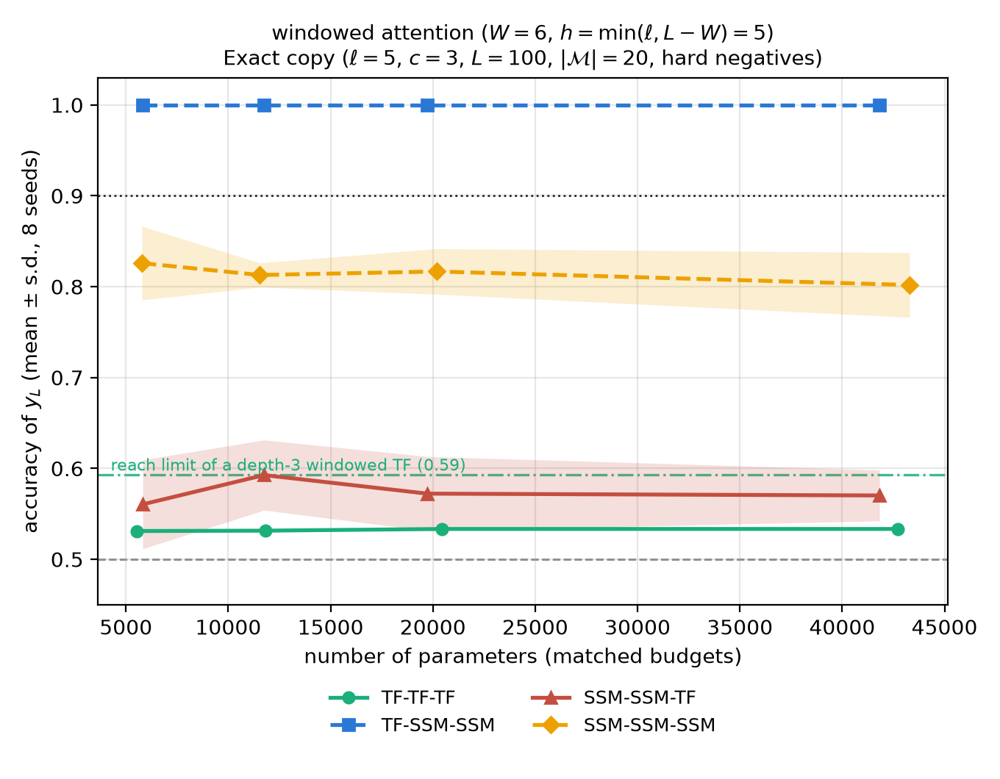

# Reverse Hybrids

Companion code for the *exact copy* experiments in **Expressivity-Efficiency Tradeoffs for Hybrid
Sequence Models**.

The question this repository answers is about **layer order**, not layer count. Take one attention
block and two selective-SSM blocks, and build two models out of exactly those three blocks:

```
TF -> SSM -> SSM          (attention first)
SSM -> SSM -> TF          (attention last)
```

They are permutations of the same multiset of blocks, so at every width they have **identical
parameter counts**. If their accuracy differs, the difference is caused by the order and nothing
else.

On the exact-copy task the answer is that order matters enormously: attention-first solves the task
perfectly at every parameter budget we tried, while attention-last never gets above ~0.63 — worse
than using no attention at all.

## Contents

| Path | What it is |
| --- | --- |
| `exact_copy/exact_copy_hybrid.py` | The whole experiment: task, models, the hand-built construction, training sweeps, and plotting. One self-contained file, no config files. |
| `exact_copy/acc_vs_params_w{6,11,21}_single_gated.png` | The headline result at three attention windows. |
| `assoc_recall/` | The 8-layer associative-recall sweeps (decode-recall, MQAR, MKAR, fuzzy recall): models, task generators, sweep runners. |

## The task: exact copy

A sequence `x` of length `L` over a vocabulary `M` **contains a copy** if some block of `l` tokens
repeats `c` times back to back:

```
x[a + j + k*l] == x[a + j + (k+1)*l]     for all j < l  and  k < c-1
```

Detecting this is equivalent to finding `r = (c-1) * l` **consecutive** positions at which
`x[t] == x[t-l]`. The label is *latched*: `y_t = 1` once a copy has completed at or before position
`t`, and the reported metric is the accuracy of the final output `y_L` (chance = 0.5).

Defaults: `L = 100`, `|M| = 20`, `l = 5`, `c = 3`, so `r = 10`. The block length `l = 5` is
deliberately larger than a standard Mamba conv kernel (4), so no single layer can fake the
comparison locally.

### Hard negatives

A negative example is built by planting a copy and then **swapping two tokens inside one of the
repeated blocks**. This leaves the token multiset of the sequence untouched, so no counting or
frequency statistic can separate the classes — the model has to actually verify the `r` equalities.
`--self-test` measures this: the best possible threshold on a token-frequency feature separates easy
negatives easily and sits at chance against hard ones. Hard negatives are on by default
(`--hard-neg-frac 1.0`).

## The architecture family

Both arms are built from the same two blocks, so there is no hidden asymmetry in the layer
implementations.

**`TF`** — LayerNorm, causal sliding-window attention with a *learnable bias per offset*, LayerNorm,
ReLU MLP. The learnable offset bias is the trainable generalisation of the construction's hard
positional bias, which is how it fetches `x_{t-l}`. Positions before the start of the sequence are
folded into one extra "sink" logit, which makes the construction's boundary behaviour exact rather
than approximate.

**`SSM`** — LayerNorm, optional depthwise causal conv, then the selective recurrence

```
S_t = (1 - Δa_t · A) S_{t-1} + (Δb_t · u_t) B_t          y_t = <C_t, S_t>
```

followed by a SiLU output gate. With `Δa == Δb` this is a single shared gate; `two_gated=True` gives
independent `Δa` and `Δb`.

Layer tokens accepted by `--layers` / `--configs`:

| Token | Meaning |
| --- | --- |
| `TF` | attention block |
| `SSM2` | two-gated SSM (independent `Δa`, `Δb`) |
| `SSM1` | single-gated SSM (one shared `Δ`) |
| `SSM` | two-gated if it is the *first* SSM in the stack, single-gated otherwise |

`SSM` encodes the construction's rule: the first SSM has to *count*, which needs two gates, and the
second only has to *latch*, which does not. That rule does not look at where the `TF` block sits, so
every permutation of one multiset of tokens has the same parameter count.

There is also a `generic` variant (`--variant generic`) built from an off-the-shelf RoPE transformer
block and a standard Mamba block (expand 2, conv kernel 4, `D` skip). It exists as a robustness
check that the ordering result is not an artefact of the custom blocks.

## The construction: exact weights, no training

`--verify` writes the paper's construction into a `TF -> SSM -> SSM` model **by hand** and checks it
without any training:

1. **Attention** sets `W_q = W_k = 0` and uses the offset bias to attend to exactly offset `l`,
   copying a balanced code of `x_{t-l}` into a spare slice of the residual stream.
2. **MLP** turns the pair `(x_t, x_{t-l})` into a large-margin equality logit `e_t`, realised as a
   Hamming distance with `2 log|M|` ReLU units.
3. **First SSM** (two gates) is the run-length counter `H_t = e_t (H_{t-1} + 1)`.
4. **Second SSM** (one gate) is the latch `y_t = (1 - z_t) y_{t-1} + z_t` with `z_t = 1{H_t >= r}`.
5. **Head** compares the `y` channel against a constant-ones channel.

Every threshold is computed from the *exact* LayerNorm statistics of the finitely many residual
vectors the stack can produce, which is why the result is exact and not approximate: the script
asserts 100% accuracy at every position on the held-out set. The construction needs width

```
d >= 4 * ceil(log2 |M|) + 4        (= 24 for |M| = 20)
```

Its point is drawn on the sweep figures as the architecture's ceiling. Anything a trained model
fails to reach above that point is an **optimisation** gap, not an **expressivity** gap.

## Installation

Nothing to build — the file is plain PyTorch.

```bash
pip install torch numpy matplotlib
```

Requirements: Python 3.8+, PyTorch 1.10+, NumPy, Matplotlib. A GPU is strongly recommended for the
training sweeps but not required for `--self-test`, `--verify`, or `--params-table`. The models are
tiny (a few tens of thousands of parameters) and need well under 1 GiB; `--max-gpu-gb` (default 18)
caps this process's allocator anyway, so a shared GPU cannot be starved.

## Usage

All modes are flags on one script. Run them from `exact_copy/`.

| Command | What it does |
| --- | --- |
| `python exact_copy_hybrid.py --self-test` | correctness checks, no training |
| `python exact_copy_hybrid.py --verify` | hand-build the construction, assert 100% at every window |
| `python exact_copy_hybrid.py --params-table` | parameter counts per width and per arm |
| `python exact_copy_hybrid.py --compare` | train every `--configs` arm, write figures + `runs.json` |
| `python exact_copy_hybrid.py --sweep` | train a single arm (`--layers`) |
| `python exact_copy_hybrid.py --replot DIR...` | merge the `runs.json` of several dirs into one figure |
| `python exact_copy_hybrid.py --acc-figures DIR...` | redraw accuracy-vs-parameters only, one figure per attention window and gating family |

The default `--compare` is the headline pair, and needs no other flags:

```bash
python exact_copy_hybrid.py --compare \
  --configs construction:TF,SSM,SSM construction:SSM,SSM,TF
```

### Outputs

Everything lands in `--out-dir` (default `results/`):

- `runs.json` — every run, plus the per-width summary. Rewritten after each run, so a long sweep
  survives being killed.
- `params_vs_acc.png` — three panels: mean accuracy, solve rate with 95% Wilson intervals, and every
  individual run with the hand-built construction marked as a star.
- `learning_curves.png` — one line per seed, panelled by parameter budget, showing where the jump
  happens.
- `acc_vs_params_w*_*_gated.png` — written by `--acc-figures`.

### How a run is scored

The outcome distribution is bimodal: a run either sits at chance or jumps to near-perfect. So the
headline number is the **solve rate** — the fraction of seeds reaching `y_L` accuracy `>= 0.9` — not
the mean, because averaging one 0.99 with two 0.49 gives a 0.66 that no run ever achieved. The mean
is reported as a secondary statistic. Both arms share one learning-rate grid and the best learning
rate is chosen per arm and per width, so tuning budget is matched too.

## Results



Mean `y_L` accuracy over 8 seeds, at four matched parameter budgets, with a window of `W = 6`
(`= l + 1`, the smallest window the construction needs). The other two figures repeat this at
`W = 11` and `W = 21`.

| Arm | `W = 6` | `W = 11` | `W = 21` |
| --- | --- | --- | --- |
| `TF -> SSM -> SSM` | **1.00** | **1.00** | **1.00** |
| `SSM -> SSM -> SSM` | 0.80 – 0.83 | 0.80 – 0.83 | 0.80 – 0.83 |
| `SSM -> SSM -> TF` | 0.56 – 0.59 | 0.56 – 0.63 | 0.58 – 0.63 |
| `TF -> TF -> TF` | 0.53 | 0.61 | 0.70 |
| *reach limit of a depth-3 windowed TF* | *0.59* | *0.68* | *0.85* |

Three things to read off it:

- **Order dominates parameters.** `TF -> SSM -> SSM` is at 1.000 from the smallest budget onward,
  and its permutation `SSM -> SSM -> TF` — same blocks, same parameter count, same data, same
  learning-rate grid — never leaves the 0.56–0.63 band and does not improve with scale. The gap is
  flat in parameters, so it is not something a larger model closes.
- **Attention in the wrong place is worse than no attention.** The pure SSM stack reaches ~0.81,
  above `SSM -> SSM -> TF`. Spending a third of the budget on a block that cannot be used where it
  sits costs accuracy outright.
- **The pure transformer is limited by reach, and the hybrid is not.** A depth-3 windowed attention
  stack cannot see further back than `3(W-1)+1` positions, so it must answer 0 on any copy that
  completed earlier than that; the dash-dotted line is the resulting cap. `TF -> TF -> TF` tracks
  that cap as the window grows. The construction only ever reads offset `l`, so it is exact at every
  window down to `W = l + 1`. Check `[12]` of the self-test *measures* both facts rather than
  assuming them.

### Reproducing the figures

One `--compare` per window, then one `--acc-figures` over the results. The four arms no longer come
from a single multiset of blocks (`TF,TF,TF` and `SSM1,SSM1,SSM1` are different stacks), so widths
are chosen per arm to hit shared parameter budgets with `--match-params`:

```bash
cd exact_copy

# arms that contain a TF block: one sweep per attention window
for W in 6 11 21; do
  python exact_copy_hybrid.py --compare --window $W --match-params \
    --targets 6000 12000 20000 42000 \
    --configs construction:TF,SSM1,SSM1 construction:SSM1,SSM1,TF construction:TF,TF,TF \
    --out-dir results_w$W
done

# the pure SSM stack never reads the window, so it is trained once and reused
python exact_copy_hybrid.py --compare --match-params \
  --targets 6000 12000 20000 42000 \
  --configs construction:SSM1,SSM1,SSM1 \
  --out-dir results_ssm

python exact_copy_hybrid.py --acc-figures results_w6 results_w11 results_w21 results_ssm \
  --out-dir figures
```

Each sweep is `arms x budgets x learning rates x seeds` runs — 128 per arm above (4 budgets, and the
default 4 learning rates and 8 seeds) — and every run prints its own wall-clock time and peak GPU
memory. Sweeps can be split across processes and merged later with `--replot` / `--acc-figures`,
because runs are independent and share one fixed held-out evaluation set.

## What keeps the comparison fair

This is the part worth checking before believing the result, so each item is enforced in code:

- **Parameter count.** Permutations of one multiset of blocks have identical parameter counts at
  every width; self-test `[8]` asserts it for both variants. Arms built from *different* blocks are
  matched by parameter budget instead (`--match-params`), which self-test `[8b]` shows lands within
  6% of every budget for all arms.
- **Data.** Both arms see the same training batches (same NumPy seed) and one fixed held-out
  evaluation set (`--eval-seed`, default 12345), identical across every run.
- **Tuning.** One learning-rate grid for all arms, best learning rate reported per arm and width.
- **Attention window.** `--window` is shared by all arms. The committed figures use bounded windows
  (`6`, `11`, `21`), which is the regime the theory speaks about; the default `full` instead gives
  every arm causal attention over the whole prefix, which is the setting to use if you want to check
  that attention-last is not merely handicapped by locality.
- **Supervision.** `--supervision latched` (default) supervises `y_t` at every position, exactly what
  the construction emits; `last` supervises only `y_L`.

Two knobs can change the conclusion and are off by default:

- **`--ssm-conv K`** puts a depthwise causal conv inside every SSM block. `n` stacked SSM layers then
  reach offset `n(K-1)`, so if you want the conv to be unable to do the comparison itself, keep
  `l > n(K-1)` (e.g. `--block 8 --ssm-conv 4`).
- **`--hard-neg-frac 0`** replaces hard negatives with uniform noise, which reopens the
  token-frequency shortcut and lets any model score well for the wrong reason.

## Self-test

`--self-test` is the fastest way to convince yourself the setup is what it claims. It checks, in
order: labels against a brute-force reading of the definition `[1]`; that hard negatives preserve the
token multiset and stay short of `r` `[2]`; that the frequency shortcut is closed `[3]`; that the
`log L` parallel scan matches the sequential reference, bit-exactly in the 0/1 regime `[4]`; that the
two-gated recurrence is the counter `[5]` and the single-gate one is the latch `[6]`; what the second
gate actually buys `[7]`; the parameter-equality invariant `[8]`, `[8b]`; that the evaluation set is
fixed `[9]`; that both orders run forward in both variants `[10]`; that the hand-built construction
is exact `[11]`; and the measured reach of a windowed attention stack `[12]`.

Check `[7]` is worth calling out because it *limits* the claim: a single shared gate with the
construction's constant value path cannot count past 1, but it can count correctly if the value path
is free to scale like `1/eps`, at the cost of `O(1/eps)` weights and `O(eps)` error per step. The
second gate therefore buys **exactness at `O(1)` weights**; it is not an expressivity requirement.

## Implementation notes

- **Scan.** The recurrence is run as an associative Hillis–Steele prefix scan (`log2 L` rounds
  instead of `L`), which is several times faster than the step-by-step loop and numerically identical
  in the 0/1 regime the construction uses. `--scan sequential` switches to the reference loop.
- **No custom kernels.** Everything is stock PyTorch, so nothing here needs `mamba-ssm`,
  `causal-conv1d`, or a CUDA build.

---

# Associative recall: 8-layer sweeps (`assoc_recall/`)

The same ordering question asked over the whole 8-layer design space: with the layer count fixed,
which SSM:TF ratio and which layer *order* does each recall task prefer? Every architecture is an
8-layer stack of Mamba blocks (`S`) and RoPE transformer blocks (`T`), hidden size 384, one head,
a **sliding attention window of 20** on sequences of 100 tokens. The small window is the point: a
single attention layer cannot reach a definition 25-40 positions back, so recall has to come from
SSM state or from how the layers compose.

## Tasks

All four are next-token tasks scored by per-position accuracy on the target positions. Vocabulary:
32 value tokens `V0..V31` plus number tokens `#k` used as bits or separators.

| Task | Sequence | Target |
| --- | --- | --- |
| `decode-recall` | random stream of value tokens with bits `#0`/`#1` mixed in (p = 0.2); the bits drive a running index `s = (2s + bit) mod 32` | at every position, the token that most recently *followed* `V_s` |
| `mqar` | items `<bos> key #0 value value <eos>` packed back to back; the first occurrence of a key defines it, a later one queries it | the 2-token value of a queried key |
| `mkar` | same with a 2-token key and 1-token value | the 1-token value |
| `fuzzy` | 2-token key and 2-token value | the 2-token value |

## Architectures and protocol

`assoc_recall/decode_recall.py` holds the table `CONFIGS`: 36 named 8-character layouts covering
every ratio from 7:1 to 1:7 with TF-at-start, TF-at-end, alternating and even orderings, and all
eight positions of a single TF layer (e.g. `pure_tf = TTTTTTTT`, `4s4t_alternate = STSTSTST`,
`5s3t_end = SSSSSTTT`, `6s2t_start = TTSSSSSS`). `D` layouts swap Mamba for a DeltaProduct block
and need `flash-linear-attention`.

Training: 1000 sequences per epoch, batch 8, 48 epochs, AdamW. The learning rate is chosen **per
architecture**: lowest loss over a 7-point log grid `1e-4 .. 1e-3`, two passes of two epochs each,
cached in `results/<cond>/auto_lr.json`. Seeds: 3 to screen and 5 for finalists on decode-recall,
5 on MQAR, 7 on MKAR and fuzzy. Metric: per-position accuracy on target positions.

## Usage

```bash
cd assoc_recall
pip install -r requirements.txt          # mamba_ssm / causal_conv1d need the wheel for your torch+CUDA
export WANDB_MODE=disabled

python decode_recall.py --round1         # all configs, 3 seeds, auto-LR each (resume-safe)
python decode_recall.py --round2         # 5 seeds on the round-1 finalists
python decode_recall.py --config 4s4t_alternate [--lr 3e-4 --seed 0]
python mqar.py; python mkar.py; python fuzzy.py
python plot_architecture_sweep.py        # decode-recall accuracy vs #SSM
```

Every run writes `results/<cond>/<task>/<config>/<config>__lr<lr>__seed<k>.json`; existing files
are skipped. `--dry-run` prints the plan.

## Results

Mean accuracy over seeds, d = 384, window 20, 48 epochs, auto-LR per config.

| | decode-recall (5 seeds) | MQAR (5) | MKAR (7) | fuzzy (7) |
| --- | --- | --- | --- | --- |
| `pure_tf` (TTTTTTTT) | 0.74 | 0.47 | 0.31 | - |
| `pure_ssm` (SSSSSSSS) | 0.49 | 0.59 | 0.33 | - |
| `4s4t_alternate` (STSTSTST) | **0.81** | 0.92 | 0.50 | 0.57 |
| `5s3t_end` (SSSSSTTT) | 0.77 | **0.94** | 0.63 | 0.57 |
| `6s2t_start` (TTSSSSSS) | 0.55 | 0.70 | **0.67** | **0.77** |
| `7s1t_start` (TSSSSSSS) | 0.79 | 0.64 | 0.66 | - |

- **Ratio barely matters, order does.** On decode-recall the best order at every ratio from 2:6
  to 7:1 lands within 0.75-0.81; the only cliff is `pure_ssm`. Within a ratio every order that
  *ends* in TF beats every order that ends in SSM, and TF-first (`TTSSSSSS`, 0.55) is worse than
  pure TF.
- **The best order is task-dependent.** Alternating wins decode-recall and is within noise of the
  TF-at-end winner on MQAR; the multi-token-key tasks (MKAR, fuzzy) prefer the SSM-heavy TF-first
  stack that loses on decode-recall.
- **Pure SSM beats pure TF on MQAR** (0.59 vs 0.47), the reverse of decode-recall: unbounded
  recurrence reaches definitions a width-20 window cannot.

## Citation

If you use this code, please cite the paper:

```bibtex
@article{reverse-hybrids,
  title  = {The Importance of Layer Ordering in Deep Hybrid Architectures},
  year   = {2026}
}
```
